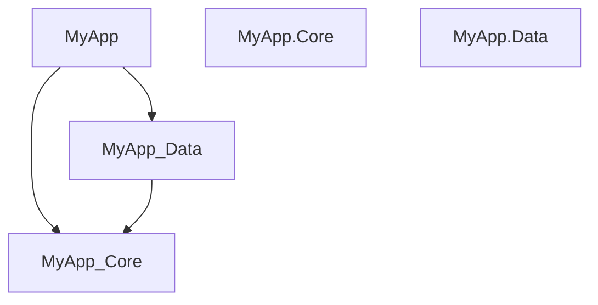

# Solution Dependency Graph

A Visual Studio 2022 / 2026 extension that generates dependency graphs and project metadata from your solution — all from a right-click context menu on the Solution node.

Easy for you coding AI agent to understand your project metadata.

## Features

| Command | Output | Description |
|---|---|---|
| **Generate Dependency Graph** | `dependency-graph.mmd` | Scans all `.csproj` files for `ProjectReference` entries and outputs a [Mermaid](https://mermaid.js.org/) diagram |
| **Generate Restore Graph (JSON)** | `_restore_graph.json` | Runs MSBuild `/t:GenerateRestoreGraphFile` to produce a full NuGet dependency graph |
| **Generate Project List** | `_projects_from_sln.txt` | Extracts all `.csproj` paths from the `.sln` file, sorted and deduplicated |

All output files are saved to the **solution root folder**.

## Usage

1. Right-click the **Solution node** in Solution Explorer
2. Select one of the three commands
3. Output file is written to the solution folder

### Viewing the Mermaid Graph

- **VS Code**: Install the [Mermaid Preview](https://marketplace.visualstudio.com/items?itemName=bierner.markdown-mermaid) extension, then open the `.mmd` file
- **Online**: Paste the contents into [Mermaid Live Editor](https://mermaid.live/)
- **CLI**: Use [mermaid-cli](https://github.com/mermaid-js/mermaid-cli) to export as SVG/PNG

### Example Output

## Installation

### From MarketPlace

1. Download the `.vsix` from [MarketPlace](https://marketplace.visualstudio.com/items?itemName=ONGYISHEN.sdg17)
2. Double-click to install
3. Restart Visual Studio

### From Source

1. Clone this repo
2. Open `SolutionDependencyGraph.sln` in Visual Studio 2022
3. Press **F5** to launch the experimental instance

## Requirements

- Visual Studio 2022 / 2026  (Community, Professional, or Enterprise)
- .NET Framework 4.7.2+

## License

[MIT](LICENSE.txt)
